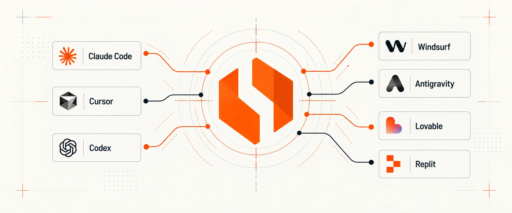

<p align="center">
  
</p>

<h1 align="center">HOC Guard MCP</h1>

<p align="center">
  <strong>Privacidade e LGPD resolvidas de dentro do seu agente de código.</strong><br>
  Banner de cookies, consentimento e varredura de privacidade, sem sair do editor.
</p>

<p align="center">
  <a href="./LICENSE"></a>
  <a href="https://modelcontextprotocol.io"></a>
  
  
  
</p>

<p align="center">
  <a href="#instalar">Instalar</a> ·
  <a href="#como-usar">Como usar</a> ·
  <a href="#ferramentas">Ferramentas</a> ·
  <a href="#configuração">Configuração</a> ·
  <a href="#princípios">Princípios</a>
</p>

---

Qualquer pessoa cria um app hoje. Quase ninguém sabe o que a LGPD exige dele, e quando pede à IA,
ela improvisa: banner que não bloqueia nada, rastreador disparando antes do consentimento,
formulário sem base legal.

O **HOC Guard MCP** faz o seu agente acertar isso por padrão. Ele lê o seu projeto, entende o que a
aplicação coleta e entrega o código pronto, sobre o SDK do [HOC Guard](https://guard.hoc.app.br),
para o próprio agente aplicar.

> **"Meu app está pronto para lançar?"** é a pergunta. O Guard responde com código, não com um
> relatório.

## Instalar

> [!NOTE]
> Preview: ainda não publicado no npm. A instalação é direto do GitHub.

<details open>
<summary><strong>Claude Code</strong></summary>

```bash
claude mcp add hoc-guard -- npx -y github:HOCGuard/guard-mcp#claude/awesome-franklin-0jy5of
```

</details>

<details>
<summary><strong>Codex</strong></summary>

Em `~/.codex/config.toml`:

```toml
[mcp_servers.hoc-guard]
command = "npx"
args = ["-y", "github:HOCGuard/guard-mcp#claude/awesome-franklin-0jy5of"]
```

</details>

<details>
<summary><strong>Cursor, Windsurf, Antigravity e outros clientes MCP</strong></summary>

No arquivo de configuração de MCP do cliente:

```json
{
  "mcpServers": {
    "hoc-guard": {
      "command": "npx",
      "args": ["-y", "github:HOCGuard/guard-mcp#claude/awesome-franklin-0jy5of"]
    }
  }
}
```

</details>

## Como usar

Dentro do projeto, peça em linguagem natural:

```text
Coloque um banner de cookies conforme a LGPD neste site.
```

O agente chama `guard_generate_cookie_banner`, que:

1. **Lê o projeto na sua máquina** e detecta os rastreadores em uso (Google Analytics, GTM,
   Meta Pixel, TikTok, LinkedIn, Hotjar, Clarity, Vercel Analytics).
2. **Gera a integração do banner** para carregar antes de qualquer tag.
3. **Bloqueia cada rastreador até o consentimento**, na finalidade certa.

Depois de publicar, confira:

```text
Verifique se o banner do meu site realmente bloqueia os rastreadores.
```

> [!IMPORTANT]
> Por enquanto o banner usa um `banner_id` criado no painel do HOC Guard. Inclua no pedido:
> *"use o banner_id bn_..."*. A criação sem conta pelo próprio MCP está a caminho.

## Ferramentas

| Ferramenta | O que faz |
|---|---|
| `guard_generate_cookie_banner` | Lê o projeto Next localmente, detecta os rastreadores e devolve a integração do banner com cada um bloqueado até o consentimento |
| `guard_scan_site` | Inicia a varredura de um site publicado. Abre um navegador de verdade, aceita e rejeita o banner e observa o que dispara em cada caso |
| `guard_get_scan_status` | Diz se a varredura terminou. Leva cerca de dois minutos |
| `guard_get_scan_results` | Devolve os achados do mais grave para o menos grave, com a nota geral |

A varredura é demorada, então o ciclo tem três passos em vez de uma chamada que expira. O resultado
traz só o que precisa de atenção; passe `include_passed` para ver também o que está correto.

## Configuração

| Variável | Padrão | Para quê |
|---|---|---|
| `GUARD_SDK_URL` | `https://guard.hoc.app.br/sdk/banner.js` | De onde o site carrega o banner |
| `GUARD_API_URL` | `http://localhost:3085` | Onde está o serviço de varredura |
| `GUARD_TENANT` | `public` | Identificação da conta, quando houver |
| `GUARD_REQUEST_TIMEOUT_MS` | `15000` | Tempo limite de cada chamada, não da varredura |

## Princípios

| | |
|---|---|
| 🔒 **Seu código não sai da sua máquina** | A análise de código roda local. Varredura de site é remota, porque site é público por definição |
| 🆓 **Sem conta para o básico** | As ferramentas desta camada não guardam dados do cliente |
| ⚖️ **Conformidade nunca é limitada** | O que é grátis é conforme. O pago é conveniência e escala |
| 🪪 **Varredura profunda só com prova de propriedade** | Banco de dados e repositório privado exigem comprovação de que o alvo é seu |
| 🧱 **Saída é dado, não instrução** | O que voltar de um site varrido nunca é tratado como comando pelo agente |

## Desenvolvimento

```bash
npm install
npm run build
npm test
```

## Licença

[Apache-2.0](./LICENSE). O servidor é aberto para você auditar o que instalou; os motores do HOC
Guard rodam no nosso serviço.

<p align="center">
  <sub>Feito pelo <a href="https://guard.hoc.app.br">HOC Guard</a>.</sub>
</p>
